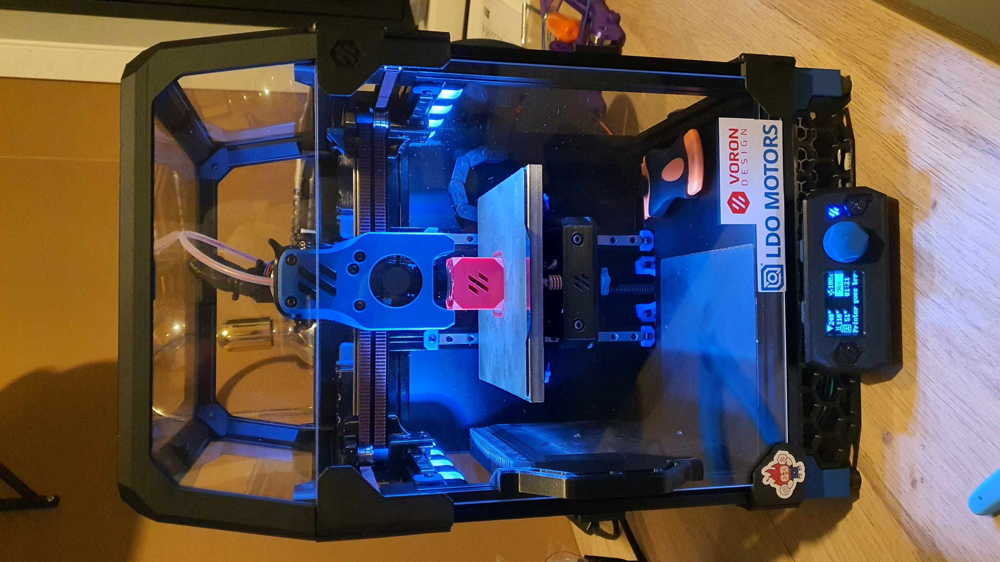

# v0-870-klipper_config

Klipper configs for this printer running fluidd.

# Table of Contents
**(!)** = has important warning
- [**(!)** Change Log](#change-log)
- [Printer Mods](#printer-mods)
- [Klipper Plugins](#klipper-plugins)
- [Credits](#credits-in-no-particular-order)

# Change Log

Changes will be noted here by date, title if needed, files changed, summary of changes. 

_**Note: only changes of signifigance will be added.**_

- **24-11-2021:** Add nevermore filter warning.
    * Added
        * `saved_cariables.cfg`
            * To get the total's already in fluidd calculate the total time over to seconds and use it in `totalprintingtime`. For total filament used, multiply it by 1000 to get the value in mm.
            * `filament_used = 0`
            * `filterusetime = 0`
            * `lastservicetime = 0`
            * `totalprintingtime = 0`
        * `macros/user_variables.cfg`
            * variable_nevermore_use_time: 80 ; Nevermore change warning limit (In hours)`
        * `macros/statistics.cfg`
            * Grab the whole file, it's new. Thanks to [zellneralex](https://github.com/zellneralex/klipper_config/blob/master/printtime.cfg) for making this awesome thing.
        * `macros/printing.cfg`
            * Add this to the `[PRINT_END]` macro to start adding time to the statistics, and checking the filter run-time:
            * `_ADD_PRINT_TIME`
            * `_SD_PRINT_STATS R='done'`
            * `_SD_PRINTER_STATS`

# Printer Mods

* [Timmit's klipper expander](https://github.com/VoronDesign/Voron-Hardware/tree/master/Klipper_Expander)
* [Timmit's umbilical pcb's](https://github.com/VoronDesign/Voron-Hardware/tree/master/V0-Umbilical)
* [Timmit's v0 display](https://github.com/VoronDesign/Voron-Hardware/tree/master/V0_Display)
* [221 wago mount for bed](https://github.com/VoronDesign/VoronUsers/tree/master/printer_mods/BlueBear/Wago_221_mount)
* [NeverMore v5 duo](https://github.com/nevermore3d/Nevermore_Micro/tree/master/V5_Duo/V0)
* [1515 snap in led mounts](https://github.com/newphreak/VoronUsers/tree/1515ledmod/printer_mods/Jon/1515_led_mount)

# Klipper Plugins

* gcode_shell_command

# Credits in no particular order

* [VoronDesign](https://github.com/VoronDesign)
* [eecue's klipper_config](https://github.com/eecue/klippper-config)
* [zellneralex's klipper_config](https://github.com/zellneralex/klipper_config)
* [FHeilmann's klipper_config](https://github.com/FHeilmann/klipper_config/)
* [Ellis's klipper_config](https://github.com/AndrewEllis93/v2.247_backup_klipper_config/)
* [th33xitus/kiauh klipper github backup](https://github.com/th33xitus/kiauh/wiki/How-to-autocommit-config-changes-to-github%3F)
* [Ette's enraged rabbit carrot feeder macro's for filament unload](https://github.com/EtteGit/EnragedRabbitProject)
